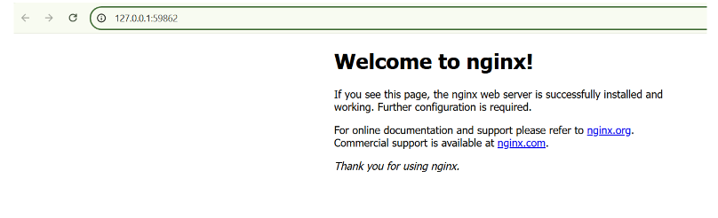

=======
# Default nginx basic 
## Bài 1
 Triển khai deployment chạy nginx (default) lên kubernetes và cho phép truy cập từ bên ngoài thông qua nodePort. 

 Output:
 - 1 deployment nginx (replicas=2 pod)
 - 1 nodePort service trỏ tới deployment
 - Thực hiện curl tới nodePort và cho ra kết quả trang web mặc định của nginx

## Bài làm
1. Mở `docker` 
2. Thực hiện lệnh `minikube start`
3. Triển khai deployment và service 

    

4. Kiểm tra deployment và service đã được tạo thành công hay chưa 

    

5. Lấy ip của minikube 

    

6. Truy cập trang web được từ localhost 

    
    

7. Truy cập từ bên ngoài 
    - Để truy cập từ bên ngoài, sử dụng ngrok 
    - ngrok là một công cụ tạo secure tunnel từ internet vào máy tính cục bộ. Có thể truy cập các ứng dụng trên máy cục bộ thông qua một URL công khai. 
    - Mở PowerShell với quyền admin: chạy lệnh `ngrok http 59862` 

        

    - Truy cập: `https://5e9a-2402-800-61ca-716c-758d-79ba-17e5-2d70.ngrok-free.app/` sẽ trả về trang web mặc định của Nginx (được truy cập từ bên ngoài)

         

>>>>>>> d8fdbe0 (Initial commit)

