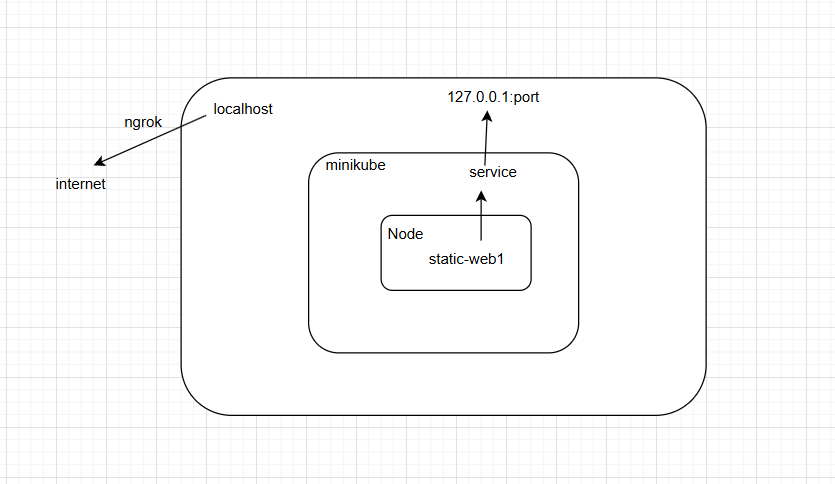
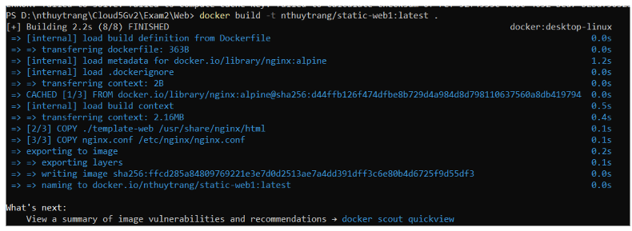
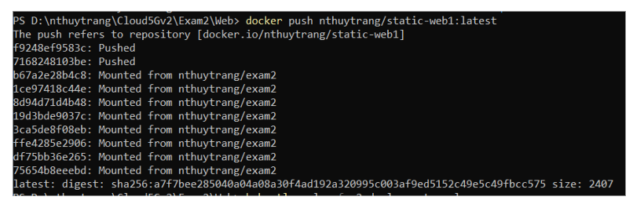
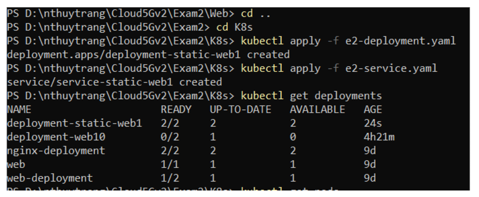
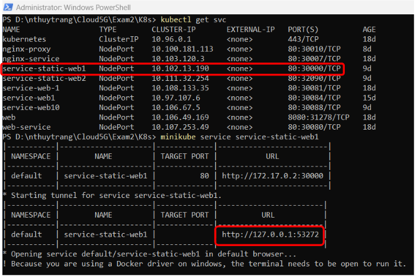
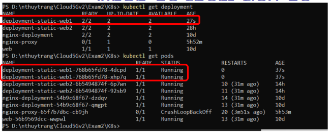
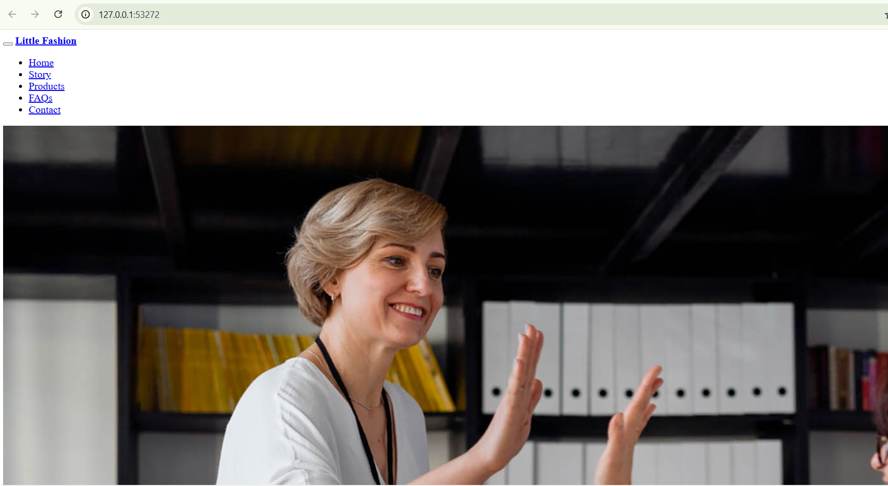
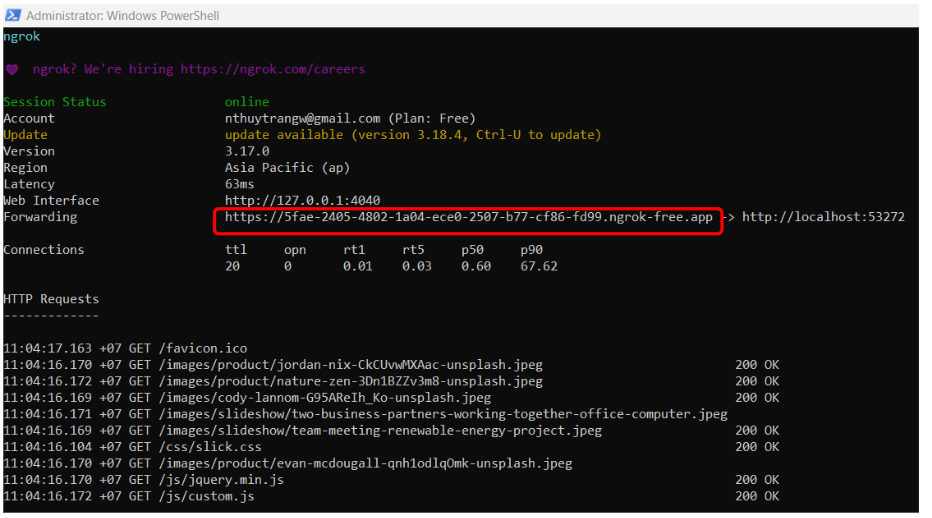
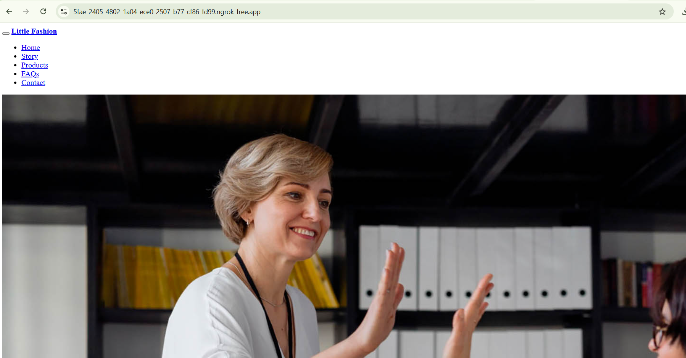

# Static web pod - Intermediate 
## Bài 2
 Triển khai deployment một ứng dụng web tĩnh lên kubernetes cho phép truy cập từ
bên ngoài thông qua nodePort.
 
 Output:
- Đóng gói thành công container chứa web tĩnh
    - download 1 template tại https://www.free-css.com/free-css-templates
    - sử dụng base image nginx
    - ưu ý cấu hình nginx trỏ tới web tĩnh (tham khảo file cấu hình mẫu đơn giản
tại https://gist.github.com/mockra/9062657 )
- 1 deployment chạy ứng dụng web tĩnh (replicas=2)
- 1 nodePort service trỏ tới deployment (service web 1)
- Thực hiện curl tới nodePort và cho ra kết quả trang web tĩnh theo template

## Bài làm
*Tổng quan* 
    

1. Mở `docker`
2. Thực hiện lệnh `minikube start`
3. Download 1 template và đóng gói container
    - Download 1 template và để trong thư mục `template-web`
    - Tạo file `nginx.conf`
    - Viết `dockerfile`
    - Đóng gói thành một image và push lên DockerHub

        
        

4. Tạo file yaml và triển khai ứng dụng lên K8s 
    - Tạo file `e2-deployment.yaml` và `e2-service.yaml`
    - Triển khai 

        

    - Kiểm tra trạng thái pod, svc: 

        

        

5. Truy cập trang web 
    - Truy cập được từ localhost 
        

        

    - Truy cập từ bên ngoài thông qua `ngrok`
        - Thực hiện lệnh `ngrok http 53272` và truy cập trang web từ bên ngoài. 

            

            
