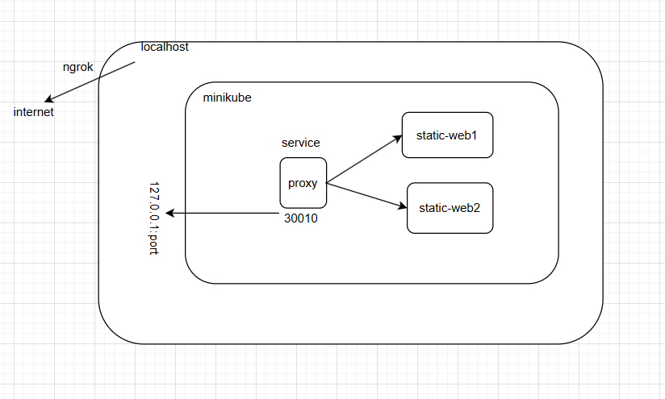
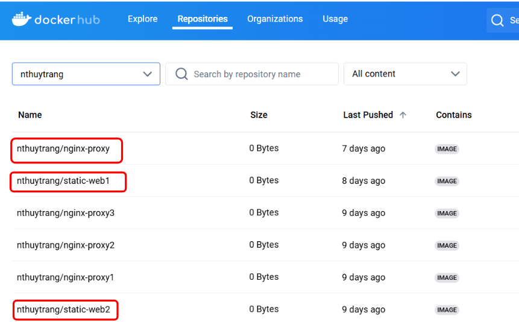
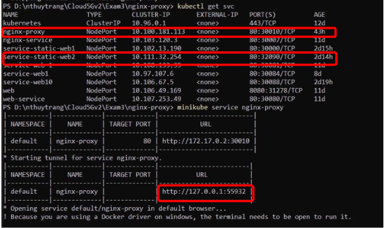
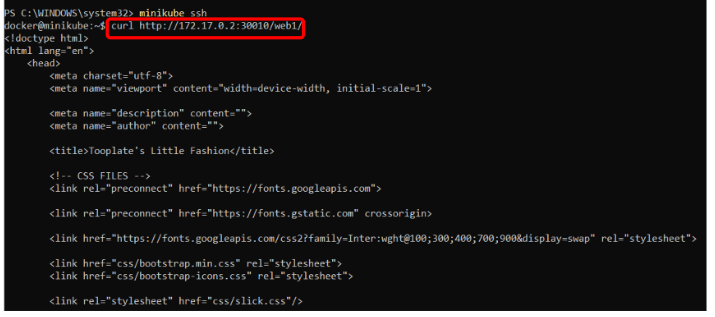

# Nginx-proxy - Advanced 
## Bài 3
Triển khai nginx proxy cho nhiều ứng dụng
- Từ level 2, triển khai thêm 1 trang web static thứ hai, khác với static web đã triển khai
- Service cho trang web tĩnh mới được lấy tên là web2
- Triển khai thêm 1 deployment nginx-proxy đóng vai trò proxy cho cả 2 ứng dụng trên và tạo nodePort service có tên "nginx-proxy” 
- Thiết lập cấu hình config của nginx-proxy sao cho:
    - Khi gọi tới nginx-proxy với path /web1 > nginx-proxy filter path và forward tới service web 1 >service web1
    - khi gọi tới nginx-proxy với path /web2 > nginx-proxy filter path và forward tới service web 2 >service web2

Output:
- curl http://\<node-ip>:\<node-port>/web1 > trả về static web 1
- curl http://\<node-ip>:\<node-port>/web2 > trả về static web 2
## Bài làm
*Tổng quan* 
    

1. Download 1 template và đóng gói container
    - Download 1 template khác và để vào thư mục `template-web2`
    - Tạo file `nginx.conf`
    - Viết `dockerfile`
    - Đóng gói thành một image `static-web2` và push lên DockerHub 

        

2. Triển khai thêm 1 deployment nginx-proxy
    - Tạo file `nginx-proxy.yaml` 
    - Tạo file `nginx.conf`: cấu hình file nginx.conf cần chú ý các dấu `/` ở `web1/` `web2/` để khi truy cập đường dẫn sẽ đúng yêu cầu đề bài. 
    - Viết `dockerfile` 
    - Đóng gói thành một image `nginx-proxy` và push lên DockerHub 

        

3. Tạo file yaml và triển khai ứng dụng lên K8s
    - Tạo file `nginx-proxy.yaml` 
    - Tạo file `e3-deployment.yaml` và `e3-service.yaml` 
    - Dùng lệnh `kubectl apply` để triển khai lên K8s như những bài trước 
    - Kiểm tra trạng thái pod, svc:

        
4. Truy cập trang web 
    - Truy cập thông qua nginx-proxy, thực hiện `mimikube service nginx-proxy` 

        

    - Đối với `web1` 
        - Thử truy cập `web1` từ máy ảo `minikube` 

            

        - Truy cập `web1` từ localhost 

            
    
    - Tương tự với `web2` 

        

    - Truy cập từ bên ngoài internet, thông qua `ngrok` tương tự như bài số 2 đã làm với `static-web1`
    - `curl http://\<node-ip>:\<node-port>/web1 > trả về static web 1`: không thể truy cập từ bên ngoài được vì minikube chỉ là một image trên Docker, vì vậy để truy cập từ bên ngoài internet thì cần sử dụng `ngrok` như các bài trước. 